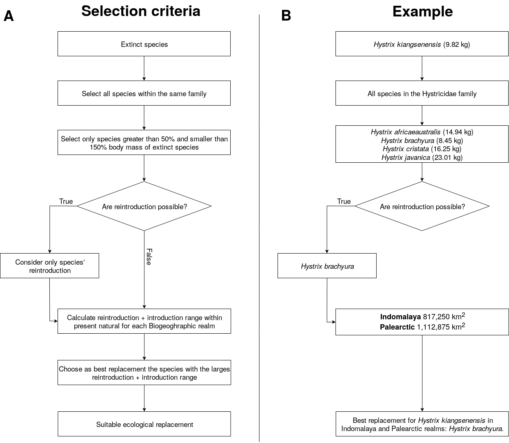

Emilio Berti$^{1, 2, *}$, Scott Jarvie$^{1, 2}$, and Jens-Christian Svenning$^{1, 2}$

$^1$ Section for Ecoinformatics and Biodiversity, Department of Bioscience, Aarhus University, Ny Munkegade 114, DK-8000 Aarhus C, Denmark.\\
$^2$ Center for Biodiversity Dynamics in a Changing World (BIOCHANGE), Department of Bioscience, Aarhus University, Ny Munkegade 114, DK-8000 Aarhus C, Denmark.\\
$^{*}$ corresponding author: emilio.berti@bios.au.dk

Keywords: defaunation, human-driven extinctions, food webs, rewilding, mammals, trophic interactions.

\clearpage

# Supporting information

## Changes to PHYLACINE database
We modified the body mass of two extinct species in the PHYLACINE database before modelling and analyses: body mass of the extinct species _Sinomegaceros ordosianus_ was set equal to the mass of _Sinomegaceros yabei_ and body mass of the extinct _Dusicyon australis_ to _Dusicyon avus_.

## Maxent species distribution models (SDMs)
Climatic suitability of terrestrial mammals was modelled using maximum entropy (Maxent) models using the *maxnet* R-package based on inhomogeneous Poisson processes [@phillips2017opening]. Maxent is a presence-background approach, in which environments occupied by a species are contrasted with the available environmental space [@elith2011statistical; @merow2013practical]. We ran Maxent with the default settings of Maxent, besides disabling threshold features to avoid locally overfitted response curves [@merow2013practical; @merow2014we]. We used 100,000 randomly sampled background records – cf. 10,000 that is commonly used – to ensure greater representation of environmental variables available within background areas [@guevara2018toward]. Background buffers were obtained for each species combining current and present-natural ranges and calculating the maximum distance between edge and centroid of the largest continuous range, ensuring buffer sizes reflected capabilities of the individuals species [@poo2014galictis; @hof2018bioenergy]. An example is shown in figure S\#. We only modelled species that had at least 10 presence locations, thus excluding 76 rare species with restricted geographic distribution. In total, we modeled 4,130 of the 4,206 living terrestrial mammals.

{ width=50% }

We assessed the predictive performance of Maxent models through five-fold cross validation: we calculated the average continuous Boyce index (CBI; @hirzel2006evaluating), which indicates how much models discriminate against random expectation, and the average Area Under the Receiver Operating Curve (AUC; @swets1988measuring), which indicates how well models differentiate between presences and pseudo-absences regardless of the degree of difference between them. Model fit was inspected by the average omission rate based on the minimum training presence value (ORMTP). CBI values range between -1 and 1, where values > 0 indicate the model's output is positively correlated with the true probability of presence and values < 0 indicate it is negatively correlated with the true probability of presence; AUC values range from <= 0.5 for models with discrimination no better than random to 1 for models with perfect discrimination between occupied and unoccupied places [@fielding1997review]; and ORMTP values range from 0 for models that are not overfit to 1 for models that are overfit. To convert continuous suitability predictions to binary layers indicating suitable/unsuitable habitat, we used as threshold the suitability value that maximised sensitivity and specificity (MSS) as suggested by @liu2016selection. We further assessed the performance of Maxent models by comparing projections of climatic suitability with 136 introduced range maps from @lundgren2018introduced (n = 22 species) and IUCN (@iucn2016iucn; n = 114 species). Introduced range maps were selected from @lundgren2018introduced over the IUCN [@iucn2016iucn] for three species found in both datasets (_Cervus elaphus_, _Ovibos moschatus_, and _Rangifer tarandus_).

Evaluation statistics indicated in general very high to excellent quality of Maxent models. CBI index and AUC were on average very high (Table S\#) and ORMTP was in low, indicating that models were in general not overfitted. Importantly, species chosen as rewilding replacement in downstream analyses had in general very high to excellent predictive performance: high CBI and AUC, and low ORMTP (Table S\#). Also, much of the species' known introduction ranges were captured by Maxent models (Fig. S\#): the median of the predicted introduction range was 0.84, with a median absolute deviation equal to 0.23.

![Evaluation statistics of Maxent species distribution models (SDMs). Continuous Boyce index (A) and the area under the receiving operating curve (AUC, B) were in general very good to excellent, showing SDMs had high performance on discriminating climatic suitable habitats from unsuitable ones. Omission rate of minimum training points (ORMTP, C) was generally low, indicating that models were not overfitting. SDMs predicted most of the ranges of introduced species not used for model calibration (D). Introduction area was obtained from the IUCN current introduction ranges [@iucn2016iucn] and the ranges described in @lundgren2018introduced, both of which were not included in the PHYLACINE present-natural and current ranges [@faurby2018phylacine].](Figures/SDM_stats.png)

<!-- |          | Median  | Median absolute deviation | Mean | Standard deviation |
|----------|---------|---------------------------|------|--------------------|
|   CBI    |   0.93  |       0.08                | 0.87 |     0.15           |
|   AUC    |   0.86  |       0.01                | 0.85 |     0.04           |
|  ORMTP   |   0.02  |       0.03                | 0.07 |     0.15           |

Table: summary statistics for the Maxent species distribution models. The continuous Boyce index (CBI) and the area under the receiver operating curve (AUC) measures models performance; the omission rate based on the minimum training presence value (ORMTP) measures models tendency to overfit the data.

|          | Median  | Median absolute deviation | Mean |  Standard deviation |
|----------|---------|---------------------------|------|---------------------|
|   CBI    | 0.98    | 0.02                      | 0.96 | 0.067               |
|   AUC    | 0.83    | 0.06                      | 0.80 | 0.069               |
|  ORMTP   | 0.01    | 0.01                      | 0.02 | 0.036               |

Table: summary statistics for the Maxent species distribution models of the selected candidate replacements (*n = 94*) in the rewilding scenario. -->

## Supplementary figures and tables



<!-- ## Statistical analyses
To investigate if trophic rewilding has the potential to restore food web interactions in the 209 protected areas examined to pre-human conditions, we used generalized linear mixed models (GLMMs). We selected the error distribution for the GLMMs based on the response data type and to remedy overdispersion [@zuur2009mixed]. We used a Poisson distribution to model the number of species at each trophic level with the fixed effects scenario, trophic level, and their interaction. A negative binomial distribution was used to model the predator-prey interactions across trophic levels with the fixed effects scenario, the trophic levels involved in the trophic link, and their interaction. For both GLMMs, we used the random effects 'protected area' and 'Ecozone' to account for non-comparable pseudo-replicates and different ecological histories of mammal assemblages in Ecozones [@olson2001terrestrial]. We assessed the significance among scenarios by performing multiple pair-wise contrasts with Bonferroni correction and estimated the magnitude of the differences using Cohen's *d* effect size [@cohen1988statistical; @sawilowsky2009new]: $d = \frac{\bar{x}_i - \bar{x}_j}{s_{ij}}$, where $\bar{x}_i$ is the sample mean of scenario *i*, $\bar{x}_j$ the sample mean of scenario *j*, and $s_{ij}$ the pooled standard deviation of samples *i* and *j*.

Finally, we repeated all analyses for 206 areas evenly distributed across Ecozones. By studying the restoration potential of trophic rewilding in protected areas, we could investigate how much trophic rewilding can restore top-down control in areas that are likely suitable for rewilding already. However, by focusing on protected areas, which are unevenly distributed on continents, we might have underestimated the potential of trophic rewilding in areas that did not have large protected areas with strict IUCN management category but that could be suitable for rewilding in the near future, e.g. rural areas in Europe where wildlife is coming back after land abandonment [@chapron2014recovery; @deinet2017wildlife]. We generated 36 random areas $\simeq$ 5,000 km^2 randomly in each Ecozone, derived their mammal assemblages for each scenario, inferred their predator-prey food webs under present-natural, current, and rewilding scenario, and performed the same statistical analyses used for the protected areas.

All data processing and analyses were performed in the R programming language version 3.6.1 [@R] using packages tidyverse [@wickham2017tidyverse], maxnet [@maxnet], dismo [@dismo], sf [@sf], raster [@raster], doParallel [@doParallel], foreach [@foreach], performance [@performance], emmeans [@emmeans], and estimate [@estimate]. All spatial analyses were conducted using the Behrmann cylindrical equal-area projection. Ecozones were derived using the World Wildlife Foundation shapefile ([WWF](https://www.worldwildlife.org/publications/terrestrial-ecoregions-of-the-world), @olson2002global). Figures were made using packages ggplot2 [@ggplot2] with maps displayed in the Molleweide projection.

## Statistical model
### Trophic levels
THe number of species per trophic level in each scenario was modeled as count data using a Poisson distribution for errors. Because the analyses were conducted on food webs that are not replicates, but pseudo-replications, we performed generalized linear mixed model regressions using scenario and trophic level as fixed effects and food webs as random factor. Moreover, Ecozones are defined based on diverging ecological and evolutionary histories and hence they were included as an additional random factor in the model to account for differences in Ecozones that are not directly comparable -- i.e. Ecozones were considered pseudo-replication rather than replicates. The complete statistical model took the mathematical form:
\begin{equation}
	N_{i, \, j} = \nu + \Sigma + (\nu \, \Sigma) + E_i + W_j + \epsilon_{i, \, j}
\end{equation}
where $N_{i, \, j}$ is the number of species, $\nu$ the effect of each trophic level, $\Sigma$ the effect of each scenario, $(\nu \, \Sigma)$ the interaction term between trophic level and scenario, $E_i$ the effect of the Ecozone, $W_j$ the effect of the food web, and $\epsilon_{i, \, j}$ the residual deviations. Specifying Ecozones and food webs as random effects means that $E_i$ and $W_j$ are drawn from normally distributed samples: $E_i \sim \mathcal{N}(\mu_e, \sigma_e)$ and $W_j \sim \mathcal{N}(\mu_w, \sigma_w)$.

Number of predator-prey interactions among trophic levels was also modeled as a discrete count distribution using a negative binomial distribution for the errors, as data was significantly overdispersed. We performed generalized linear mixed model regressions with scenario and the trophic link -- categorical variable indicating the trophic levels of prey and predators -- as fixed effect. Similarly to the number of species per trophic level, we included also food webs and Ecozones as random effect. The complete statistical model took the mathematical form:
\begin{equation}
	L_{i, \, j} = \lambda + \Sigma + (\lambda \, \Sigma) + E_i + W_j + \epsilon_{i, \, j}
\end{equation}
where $L_{i, \, j}$ is the number links between two trophic levels, $\lambda$ the effect of each trophic link, $\Sigma$ the effect of each scenario, $(\lambda \, \Sigma)$ the interaction term between trophic levels link and scenario, $E_i$ the effect of the Ecozone, $W_j$ the effect of the food web, and $\epsilon_{i, \, j}$ the residual deviations. Specifying Ecozones and food webs as random effects means that $E_i$ and $W_j$ are drawn from normally distributed samples: $E_i \sim \mathcal{N}(\mu_e, \sigma_e)$ and $W_j \sim \mathcal{N}(\mu_w, \sigma_w)$.

Statistical analyses of trophic levels were performed using *R* package *lme4* [@lme4]. The working code for the number of species per trophic level was:
```r
model <- glmer(
  Proportion ~ -1 + Scenario * Trophic_level + (1 | Ecozone) + (1 | Web),
  data = dat,
  family = 'poisson',
)
```
For the number of links among trophic levels the working code was:
```r
model <- glmer.nb(
  Proportion ~ -1 + Scenario * Edge + (1 | Ecozone) + (1 | Web),
  data = dat,
  control = glmerControl(optimizer = "bobyqa", optCtrl=list(maxfun=10e6))
)
```
We used *R* package *emmeans* [@emmeans] and *estimate* [@estimate] to perform pairwise contrasts adjusting with the Bonferroni correction and we directly obtained the difference across scenarios of the number of species in trophic level or trophic interaction among trophic levels, the p-value of the contrast, and the effect size of the change as Cohen's *d* [@cohen1988statistical]. -->

\clearpage

|            Extinct            |        Replacement         |   Bioregraphic realm   |
|-------------------------------|----------------------------|-------------|
|       Vombatus hacketti       |   Lasiorhinus latifrons    | Australasia |
|        Arctodus simus         |        Ursus arctos        |   Neartic   |
|        Arctodus simus         |        Ursus arctos        |  Neotropic  |
|      Arctotherium wingei      |      Ursus americanus      |  Neotropic  |
|     Tremarctos floridanus     |      Ursus americanus      |   Neartic   |
|     Tremarctos floridanus     |      Ursus americanus      |  Neotropic  |
|        Ursus spelaeus         |        Ursus arctos        |  Paleartic  |
|    Catagonus stenocephalus    |       Pecari tajacu        |  Neotropic  |
|        Muknalia minima        |       Pecari tajacu        |   Neartic   |
|        Muknalia minima        |       Pecari tajacu        |  Neotropic  |
|       Tapirus augustus        |      Tapirus indicus       | Indomalaya  |
|       Tapirus augustus        |      Tapirus indicus       |  Paleartic  |
|       Tapirus merriami        |      Tapirus bairdii       |   Neartic   |
|     Tapirus rondoniensis      |     Tapirus terrestris     |  Neotropic  |
|       Tapirus veroensis       |      Tapirus bairdii       |   Neartic   |
|       Tapirus veroensis       |      Tapirus bairdii       |  Neotropic  |
|      Kolpochoerus majus       | Hylochoerus meinertzhageni | Afrotropic  |
|   Metridiochoerus compactus   |   Phacochoerus africanus   | Afrotropic  |
|        Sus bucculentus        |         Sus scrofa         | Indomalaya  |
|      Stegodon orientalis      |      Elephas maximus       | Indomalaya  |
|      Stegodon orientalis      |      Elephas maximus       |  Paleartic  |
|   Stegodon trigonocephalus    |      Elephas maximus       | Indomalaya  |
|    Elasmotherium sibiricum    |    Ceratotherium simum     |  Paleartic  |
| Stephanorhinus kirchbergensis |    Ceratotherium simum     | Indomalaya  |
| Stephanorhinus kirchbergensis |    Ceratotherium simum     |  Paleartic  |
|   Petauroides ayamaruensis    |  Pseudochirulus canescens  | Australasia |
|   Petauroides ayamaruensis    |  Pseudochirulus schlegeli  | Australasia |
|       Bettongia anhydra       |     Bettongia lesueur      | Australasia |
|       Bettongia pusilla       |     Bettongia lesueur      | Australasia |
|       Bettongia pusilla       |   Bettongia penicillata    | Australasia |
|       Potorous platyops       |     Potorous gilbertii     | Australasia |
|      Perameles eremiana       |   Perameles bougainville   | Australasia |
|       Ochotona whartoni       |      Ochotona alpina       |   Neartic   |
|       Neovison macrodon       |       Neovison vison       |   Neartic   |
|       Conilurus albipes       |   Conilurus penicillatus   | Australasia |
|   Conilurus capricornensis    |   Conilurus penicillatus   | Australasia |
|        Notomys amplus         |     Notomys mitchellii     | Australasia |
|     Notomys longicaudatus     |     Notomys mitchellii     | Australasia |
|       Notomys macrotis        |     Notomys mitchellii     | Australasia |
|        Notomys mordax         |       Notomys alexis       | Australasia |
|        Notomys mordax         |       Notomys aquilo       | Australasia |
|        Notomys mordax         |       Notomys fuscus       | Australasia |
|       Notomys robustus        |       Notomys fuscus       | Australasia |
|       Pseudomys glaucus       | Pseudomys novaehollandiae  | Australasia |
|       Pseudomys gouldii       |     Pseudomys desertor     | Australasia |
|    Brachyprotoma obtusata     |    Conepatus leuconotus    |   Neartic   |
|      Manis paleojavanica      |      Smutsia gigantea      | Indomalaya  |
|       Mammut americanum       |     Loxodonta africana     |   Neartic   |
|       Mammut americanum       |     Loxodonta africana     |  Neotropic  |
|     Lagorchestes asomatus     |   Lagorchestes hirsutus    | Australasia |
|        Macropus greyi         |   Thylogale billardierii   | Australasia |
|    Metasthenurus newtonae     |       Macropus rufus       | Australasia |
|      Onychogalea lunata       |    Petrogale lateralis     | Australasia |
|    Procoptodon browneorum     |     Macropus giganteus     | Australasia |
|       Procoptodon gilli       |       Macropus rufus       | Australasia |
|       Protemnodon hopei       |    Macropus antilopinus    | Australasia |
|       Protemnodon hopei       |     Macropus giganteus     | Australasia |
|       Protemnodon hopei       |       Macropus rufus       | Australasia |
|       Protemnodon nombe       |     Macropus giganteus     | Australasia |
|      Protemnodon tumbuna      |     Macropus giganteus     | Australasia |
|    Simosthenurus maddocki     |     Macropus giganteus     | Australasia |
|      Sthenurus andersoni      |       Macropus rufus       | Australasia |
|    Thylogale christenseni     |   Dorcopsulus vanheurni    | Australasia |
|       Troposodon minor        |     Macropus giganteus     | Australasia |
|      Wallabia kitcheneri      |    Macropus fuliginosus    | Australasia |
|      Aztlanolagus agilis      |     Lepus californicus     |   Neartic   |
|      Aztlanolagus agilis      |     Lepus californicus     |  Neotropic  |
|      Aztlanolagus agilis      |   Sylvilagus floridanus    |  Neotropic  |
|     Hystrix kiangsenensis     |     Hystrix brachyura      | Indomalaya  |
|     Hystrix kiangsenensis     |     Hystrix brachyura      |  Paleartic  |
|        Hystrix refossa        |       Hystrix indica       | Indomalaya  |
|        Hystrix refossa        |       Hystrix indica       |  Paleartic  |
|    Hexaprotodon sivalensis    |   Choeropsis liberiensis   | Indomalaya  |
|      Cuvieronius hyodon       |      Elephas maximus       |   Neartic   |
|      Cuvieronius hyodon       |     Loxodonta africana     |  Neotropic  |
|    Notiomastodon platensis    |      Elephas maximus       |  Neotropic  |
|     Homotherium latidens      |      Panthera tigris       |  Paleartic  |
|       Homotherium serum       |       Panthera onca        |   Neartic   |
|       Homotherium serum       |       Panthera onca        |  Neotropic  |
|      Leopardus amnicola       |       Catopuma badia       |   Neartic   |
|      Leopardus amnicola       |      Leopardus wiedii      |  Neotropic  |
|      Miracinonyx trumani      |       Puma concolor        |   Neartic   |
|        Panthera atrox         |      Panthera tigris       |   Neartic   |
|        Panthera atrox         |        Panthera leo        |  Neotropic  |
|       Panthera spelaea        |      Panthera tigris       |   Neartic   |
|       Panthera spelaea        |      Panthera tigris       |  Paleartic  |
|       Smilodon fatalis        |      Panthera tigris       |   Neartic   |
|       Smilodon fatalis        |        Panthera leo        |  Neotropic  |
|      Smilodon populator       |        Panthera leo        |   Neartic   |
|      Smilodon populator       |      Panthera tigris       |  Neotropic  |
|        Equus francisci        |        Equus ferus         |   Neartic   |
|        Equus francisci        |        Equus ferus         |  Neotropic  |
|       Equus hydruntinus       |        Equus ferus         |  Paleartic  |
|         Equus ovodovi         |        Equus ferus         |  Paleartic  |
|      Hippidion devillei       |        Equus ferus         |  Neotropic  |
|     Hippidion principale      |        Equus quagga        |  Neotropic  |
|       Elephas iolensis        |     Loxodonta africana     | Afrotropic  |
|       Elephas iolensis        |     Loxodonta africana     |  Paleartic  |
|       Elephas namadicus       |      Elephas maximus       | Indomalaya  |
|       Elephas namadicus       |      Elephas maximus       |  Paleartic  |
|       Elephas naumanii        |      Elephas maximus       | Indomalaya  |
|       Elephas naumanii        |      Elephas maximus       |  Paleartic  |
|       Mammuthus columbi       |      Elephas maximus       |   Neartic   |
|       Mammuthus columbi       |      Elephas maximus       |  Neotropic  |
|     Mammuthus primigenius     |      Elephas maximus       | Indomalaya  |
|     Mammuthus primigenius     |      Elephas maximus       |   Neartic   |
|     Mammuthus primigenius     |      Elephas maximus       |  Paleartic  |
|      Cryptonanus ignitus      |     Thylamys venustus      |  Neotropic  |
|        Dasypus bellus         |      Dasypus kappleri      |   Neartic   |
|        Dasypus bellus         |      Dasypus kappleri      |  Neotropic  |
|      Lagostomus crassus       |     Lagostomus maximus     |  Neotropic  |
|      Agalmaceros blicki       |   Odocoileus virginianus   |  Neotropic  |
|       Cervalces scotti        |        Alces alces         |   Neartic   |
|  Haploidoceros mediterraneus  |       Cervus elaphus       |  Paleartic  |
|     Megaloceros giganteus     |        Alces alces         |  Paleartic  |
|   Morenelaphus brachyceros    |   Ozotoceros bezoarticus   |  Neotropic  |
|      Navahoceros fricki       |   Odocoileus virginianus   |   Neartic   |
|      Navahoceros fricki       |   Odocoileus virginianus   |  Neotropic  |
|      Paraceros fragilis       |   Ozotoceros bezoarticus   |  Neotropic  |
|     Rucervus schomburgki      |       Rucervus eldii       | Indomalaya  |
|      Sangamona fugitiva       |     Cervus canadensis      |   Neartic   |
|   Sinomegaceros ordosianus    |        Alces alces         |  Paleartic  |
|      Sinomegaceros yabei      |        Alces alces         | Indomalaya  |
|      Sinomegaceros yabei      |        Alces alces         |  Paleartic  |
|       Neochoerus aesopi       | Hydrochoerus hydrochaeris  |   Neartic   |
|       Neochoerus aesopi       | Hydrochoerus hydrochaeris  |  Neotropic  |
|          Canis dirus          |        Canis lupus         |   Neartic   |
|          Canis dirus          |        Canis lupus         |  Neotropic  |
|         Dusicyon avus         |     Lycalopex griseus      |  Neotropic  |
|     Protocyon troglodytes     |   Chrysocyon brachyurus    |  Neotropic  |
|    Theriodictis tarijensis    |   Chrysocyon brachyurus    |  Neotropic  |
|      Camelops hesternus       |       Camelus ferus        |   Neartic   |
|      Camelops hesternus       |    Camelus dromedarius     |  Neotropic  |
|   Hemiauchenia macrocephala   |       Lama guanicoe        |   Neartic   |
|   Hemiauchenia macrocephala   |       Lama guanicoe        |  Neotropic  |
|     Hemiauchenia paradoxa     |    Camelus dromedarius     |  Neotropic  |
|       Palaeolama major        |    Camelus dromedarius     |  Neotropic  |
|      Palaeolama mirifica      |       Lama guanicoe        |   Neartic   |
|      Palaeolama mirifica      |       Lama guanicoe        |  Neotropic  |
|      Palaeolama mirifica      |      Vicugna vicugna       |  Neotropic  |
|      Palaeolama weddeli       |    Camelus dromedarius     |  Neotropic  |
|     Antidorcas australis      |      Pelea capreolus       | Afrotropic  |
|       Antidorcas bondi        |     Sylvicapra grimmia     | Afrotropic  |
|     Bootherium bombifrons     |   Connochaetes taurinus    |   Neartic   |
|     Bubalus palaeokerabau     |       Bos javanicus        | Indomalaya  |
|        CapriniGen spA         |    Tragelaphus scriptus    | Afrotropic  |
|      Damaliscus hypsodon      |    Tragelaphus scriptus    | Afrotropic  |
|        Damaliscus niro        |   Alcelaphus buselaphus    | Afrotropic  |
|    Euceratherium collinum     |        Bison bison         |   Neartic   |
|    Euceratherium collinum     |        Bison bison         |  Neotropic  |
|       Gazella atlantica       |     Ammotragus lervia      |  Paleartic  |
|        Gazella bilkis         |    Capricornis crispus     | Afrotropic  |
|        Gazella bilkis         |    Naemorhedus caudatus    | Afrotropic  |
|        Gazella bilkis         |     Procapra gutturosa     | Afrotropic  |
|        Gazella bilkis         |    Procapra przewalskii    | Afrotropic  |
|        Gazella bilkis         |    Eudorcas albonotata     |  Paleartic  |
|        Gazella saudiya        |      Gazella gazella       | Afrotropic  |
|        Gazella saudiya        |      Gazella gazella       |  Paleartic  |
|       Gazella tingitana       |      Gazella cuvieri       |  Paleartic  |
|     Hemitragus cedrensis      |      Capra pyrenaica       |  Paleartic  |
|    Hippotragus leucophaeus    |   Alcelaphus buselaphus    | Afrotropic  |
|    Hippotragus leucophaeus    |    Damaliscus pygargus     | Afrotropic  |
|     Megalotragus priscus      |   Alcelaphus buselaphus    | Afrotropic  |
|    Megalovis guangxiensis     |      Pseudois nayaur       | Indomalaya  |
|    Megalovis guangxiensis     |      Pseudois nayaur       |  Paleartic  |
|     Oreamnos harringtoni      |      Ovis canadensis       |   Neartic   |
|     Oreamnos harringtoni      |      Ovis canadensis       |  Neotropic  |
|      Pelorovis antiquus       |      Bos primigenius       |  Paleartic  |
|    Rusingoryx atopocranion    |    Kobus ellipsiprymnus    | Afrotropic  |
|      Sivacobus sankaliai      |      Capricornis thar      | Indomalaya  |
|      Sivacobus sankaliai      |      Capricornis thar      |  Paleartic  |
|        Soergelia minor        |       Capra sibirica       |  Paleartic  |
|    Spirocerus kiakhtensis     |      Bos primigenius       |  Paleartic  |
|      Caipora bambuiorum       |  Brachyteles arachnoides   |  Neotropic  |
|  Protopithecus brasiliensis   |  Brachyteles arachnoides   |  Neotropic  |
|     Stockoceros conklingi     |   Antilocapra americana    |   Neartic   |
|     Stockoceros conklingi     |   Antilocapra americana    |  Neotropic  |
|      Tetrameryx shuleri       |   Antilocapra americana    |   Neartic   |
|      Tetrameryx shuleri       |   Antilocapra americana    |  Neotropic  |


Table: List of extinct species and their best functional analogue replacements for each biogeographic realm. We found a suitable replacement for 127 of the 334 extinct species during the late Quaternary. In total, 94 extant mammals were selected as best ecological replacements.

\clearpage

# References
